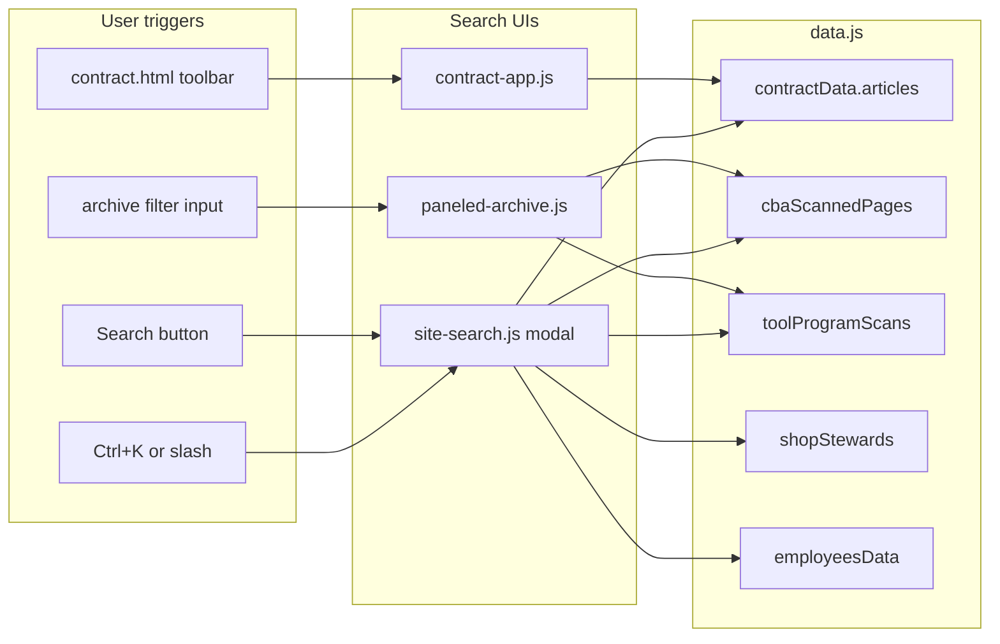

<!-- PRESERVATION RULE: Never delete or replace content. Append or annotate only. -->
# Architecture Overview

Vanilla JS/HTML/CSS approach. Single Page Application (SPA).
`data.js` exposes the contract model. `script.js` parses the data and dynamically populates the DOM. The search input filters the sections dynamically using text matching.

[AMENDED 2026-04-26]: **Multi-page gateway.** `index.html` is a thin entry (portal cards + nav). Document UIs live on separate pages: `contract.html`, `scans.html`, `tool-program.html`, `stewards.html`, `employees.html`. Shared logic is split under `js/` (`contract-app.js`, `scans-app.js`, `tool-app.js`, `paneled-archive.js`, `image-modal.js`, `shell.js`). Monolithic `script.js` removed.

[AMENDED 2026-06-26]: **Sitewide search + shared shell.** All pages load `js/nav-config.js`, `js/shell.js`, and `js/site-search.js`. `suggestions.html` added. Navigation HTML is generated from `SITE_NAV` in `nav-config.js`. Search builds a runtime index from globals in `data.js` (lazy script load on pages that do not already include `data.js`).

## Page map

| Page | Primary scripts | Data |
|------|-----------------|------|
| `index.html` | `nav-config.js`, `shell.js`, `site-search.js` | None on load (`data.js` loaded when search opens) |
| `contract.html` | + `data.js`, `contract-app.js` | `contractData` |
| `scans.html` | + `data.js`, `paneled-archive.js`, `image-modal.js`, `scans-app.js` | `cbaScannedPages` |
| `tool-program.html` | + `data.js`, `paneled-archive.js`, `image-modal.js`, `tool-app.js` | `toolProgramScans` |
| `stewards.html` | + `data.js`, `stewards-app.js` | `shopStewards` |
| `employees.html` | + `data.js`, `employees-app.js` | `employeesData` |
| `suggestions.html` | `nav-config.js`, `shell.js`, `site-search.js`, `suggestions-app.js` | None |

## Search layers

Three complementary search surfaces (not one merged UI):

1. **Sitewide** (`site-search.js`) — cross-page discovery; opens modal; indexes all major content types.
2. **Contract** (`contract-app.js` on `contract.html`) — filters/highlights CBA + separate-paper sections in place; `/` focuses toolbar search.
3. **Archive filter** (`paneled-archive.js` on scans + tool program) — filters rail list by label, title, description, transcription.

## Shared shell (`shell.js`)

- Slide-out menu from `SITE_NAV` / `SITE_PAGE_IDS` (`nav-config.js`)
- Breadcrumbs when `.breadcrumb[data-page-title]` present
- Menu focus trap; Esc closes menu (after sitewide search and image modal)

## Deep-link query parameters

| Parameter | Page | Effect |
|-----------|------|--------|
| `focus=search` | `contract.html` | Focus contract toolbar search |
| `q` | `contract.html`, `employees.html` | Pre-fill search / filter |
| `article` | `contract.html` | Scroll to article (`view-{id}`) |
| `item` | `scans.html`, `tool-program.html` | Select scan row in panel |
| `site` | `stewards.html` | Pre-select facility chip |
