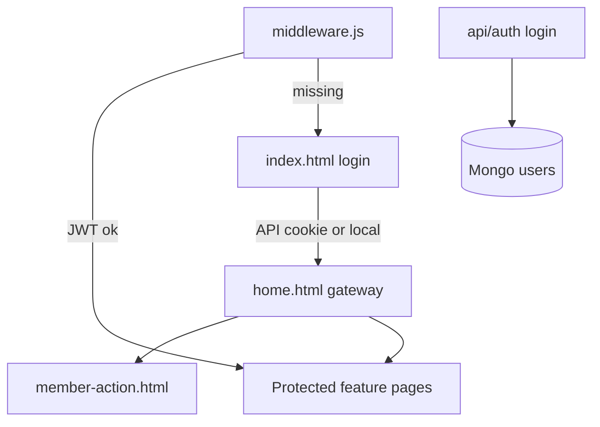
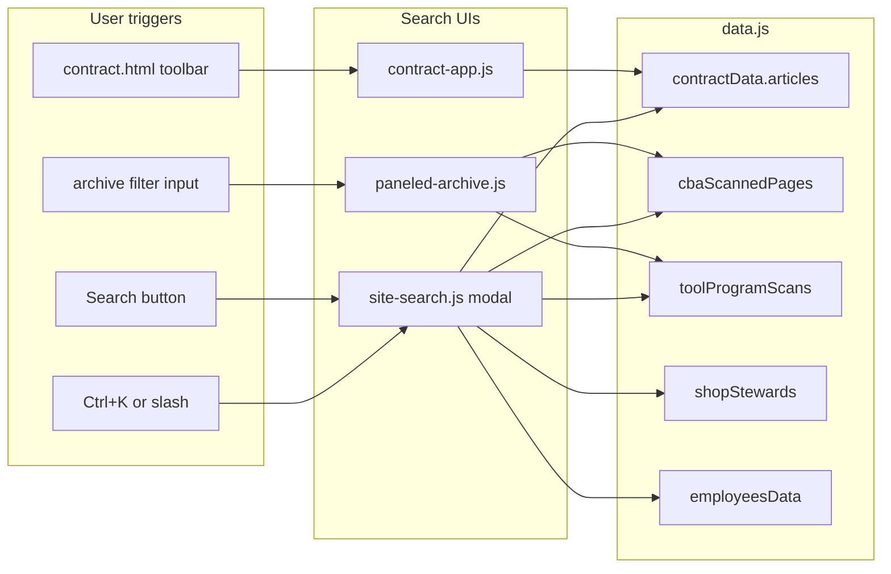

<!-- PRESERVATION RULE: Never delete or replace content. Append or annotate only. -->
# Architecture Overview

Vanilla JS/HTML/CSS approach. Single Page Application (SPA).
`data.js` exposes the contract model. `script.js` parses the data and dynamically populates the DOM. The search input filters the sections dynamically using text matching.

[AMENDED 2026-04-26]: **Multi-page gateway.** `index.html` is a thin entry (portal cards + nav). Document UIs live on separate pages: `contract.html`, `scans.html`, `tool-program.html`, `stewards.html`, `employees.html`. Shared logic is split under `js/` (`contract-app.js`, `scans-app.js`, `tool-app.js`, `paneled-archive.js`, `image-modal.js`, `shell.js`). Monolithic `script.js` removed.

[AMENDED 2026-06-26]: **Sitewide search + shared shell.** All pages load `js/nav-config.js`, `js/shell.js`, and `js/site-search.js`. `suggestions.html` added. Navigation HTML is generated from `SITE_NAV` in `nav-config.js`. Search builds a runtime index from globals in `data.js` (lazy script load on pages that do not already include `data.js`).

[AMENDED 2026-07-28]: **Auth gate + asset folders.** `index.html` is login only (`js/auth.js`, `js/login-app.js`). After sign-in, gateway is `home.html`. Every protected page loads `js/auth.js` first (sessionStorage `oe835_auth`). Sample account in `ACCOUNTS` until Vercel API + Mongo replaces it. Media under `images/`; offline drafts under `source/`.

[AMENDED 2026-07-28]: **Audit note.** `js/auth.js` must load in `<head>` (not end of body) so redirects run before paint. Login `index.html` does **not** load `nav-config` / `shell` / `site-search`. Client gate does not protect direct fetches of `data.js`, `images/`, or `source/` — see `DOCS/debugs/debug_2026-07-28_site-audit.md`.

[AMENDED 2026-07-28]: **Secure Member Action Center (1.2.0).** Production auth path: Vercel `api/auth/login|logout|me` + `middleware.js` (HttpOnly JWT cookie) + Mongo `users` / `login_attempts`. Localhost may use gitignored `local.auth.json`. New pages: `member-action.html`, `evidence-log.html`, `bargaining.html`. `source/` excluded via `.vercelignore`. `member-documents.html` is summary-only.

## Page map

| Page | Primary scripts | Data |
|------|-----------------|------|
| `index.html` | `auth.js`, `login-app.js` | API session or local.auth.json |
| `home.html` | `auth.js`, `nav-config.js`, `shell.js`, `site-search.js` | None on load |
| `contract-updates.html` | shared shell + search | Static member-facing contract and employment notices |
| `agreement-2026-27.html` | shared shell + search | Tentative CBA extension terms with original page images and source PDF |
| `calendar.html` | shared shell + search | Static upcoming member meetings and events |
| `member-action.html` | + `member-action-app.js` | None (export worksheets) |
| `evidence-log.html` | + `evidence-log-app.js` | In-memory only |
| `bargaining.html` | + `bargaining-app.js` | Static checklists |
| `member-documents.html` | shell + search | Summaries only |
| `contract.html` | + `data.js`, `contract-app.js` | `contractData` |
| `scans.html` | + `data.js`, `paneled-archive.js`, `image-modal.js`, `scans-app.js` | `cbaScannedPages` |
| `tool-program.html` | + `data.js`, `paneled-archive.js`, `image-modal.js`, `tool-app.js` | `toolProgramScans` |
| `stewards.html` | + `data.js`, `stewards-app.js` | `shopStewards` |
| `employees.html` | + `data.js`, `employees-app.js` | `employeesData` |
| `suggestions.html` | `suggestions-app.js` | Structured share/copy |

```mermaid
flowchart TD
    Login[index.html login] -->|API cookie or local| Home[home.html gateway]
    Home --> Action[member-action.html]
    Home --> Pages[Protected feature pages]
    Middleware[middleware.js] -->|JWT ok| Pages
    Middleware -->|missing| Login
    API[api/auth login] --> Mongo[(Mongo users)]
```

[AMENDED 2026-11-17]: Added member-facing `updates.html`, included in `SITE_NAV`, `SITE_PAGE_IDS`, Home, and sitewide search. The detailed CBA scan ingestion workflow is in `DOCS/CONTRACT_PAGE_INGESTION.md`; root `AGENTS.md` is canonical and root `CLAUDE.md` imports it for Claude Code compatibility.

[AMENDED 2026-11-17]: Added `contract-updates.html` as a separate member-notice page for negotiations and employment changes. It is discoverable from shared navigation, Home, and sitewide search; portal development notes remain on `updates.html`.

[AMENDED 2026-11-17]: Added `calendar.html` for upcoming Local 835 member meetings and events. Calendar entries are discoverable from Home, shared navigation, and sitewide search; notable additions are also recorded on `updates.html`.

## Search layers

Three complementary search surfaces (not one merged UI):

1. **Sitewide** (`site-search.js`) — cross-page discovery; opens modal; indexes all major content types.
2. **Contract** (`contract-app.js` on `contract.html`) — filters/highlights CBA + separate-paper sections in place; `/` focuses toolbar search.
3. **Archive filter** (`paneled-archive.js` on scans + tool program) — filters rail list by label, title, description, transcription.

```mermaid
flowchart LR
    subgraph inputs [User triggers]
        SK[Ctrl+K or slash]
        Btn[Search button]
        CBA[contract.html toolbar]
        Arch[archive filter input]
    end

    subgraph data [data.js]
        CD[contractData.articles]
        CSP[cbaScannedPages]
        TPS[toolProgramScans]
        SS[shopStewards]
        ED[employeesData]
    end

    subgraph search [Search UIs]
        Site[site-search.js modal]
        Contract[contract-app.js]
        Panel[paneled-archive.js]
    end

    SK --> Site
    Btn --> Site
    Site --> CD
    Site --> CSP
    Site --> TPS
    Site --> SS
    Site --> ED

    CBA --> Contract
    Contract --> CD

    Arch --> Panel
    Panel --> CSP
    Panel --> TPS
```

## Shared shell (`shell.js`)

- Slide-out menu from `SITE_NAV` / `SITE_PAGE_IDS` (`nav-config.js`)
- Breadcrumbs when `.breadcrumb[data-page-title]` present (Home → `home.html`)
- Sign out control (calls `Auth.logout`) when `js/auth.js` is loaded
- Menu focus trap; Esc closes menu (after sitewide search and image modal)

## Deep-link query parameters

| Parameter | Page | Effect |
|-----------|------|--------|
| `focus=search` | `contract.html` | Focus contract toolbar search |
| `q` | `contract.html`, `employees.html` | Pre-fill search / filter |
| `article` | `contract.html` | Scroll to article (`view-{id}`) |
| `item` | `scans.html`, `tool-program.html` | Select scan row in panel |
| `site` | `stewards.html` | Pre-select facility chip |

## Community forum (added 2026-11-17)

- **Client:** `forum.html` + `js/forum-app.js`. Hash routing (`#t=<threadId>`). Temp username in `localStorage` key `oe835_forum_username`; all post text rendered via `textContent`.
- **API:** `api/forum/threads.js` (GET list / POST new thread), `api/forum/thread.js` (GET thread + replies / POST reply). Shared validation + rate limiting in `api/_lib/forum.js` (underscore = not deployed as its own function).
- **Mongo collections:** `forum_threads` (title, body, category, author, createdAt, lastActivityAt, replyCount), `forum_replies` (threadId, body, author, createdAt), `forum_rate` (per-IP counters, TTL). Indexes created in `api/lib/mongo.js`.
- **Trust model:** author names are self-asserted labels, not identities. Server enforces format + reserved prefixes only.

[AMENDED 2026-11-17 9:12 p.m. EST]: Search surfaces now share accent/punctuation-insensitive matching and source-safe match highlighting. Sitewide results include score order, ordinal labels, total/truncation status, and keyboard selection announcements; forum lookup starts only for a non-trivial query. Contract tools use an accessible disclosure on mobile (≤767px) and do not stick over the reading area; `/` and `?focus=search` expand the tools before focusing the field.

[AMENDED 2026-11-17]: Added `agreement-2026-27.html` as a clearly labeled tentative companion to the 2022–2026 CBA. `images/2026-27/` preserves all three full-page JPG renderings and the supplied PDF; the three page records in `cbaScannedPages` are independently searchable and deep-linkable from Scanned Pages. The source copy's ratification/signature status is not represented as confirmed.
